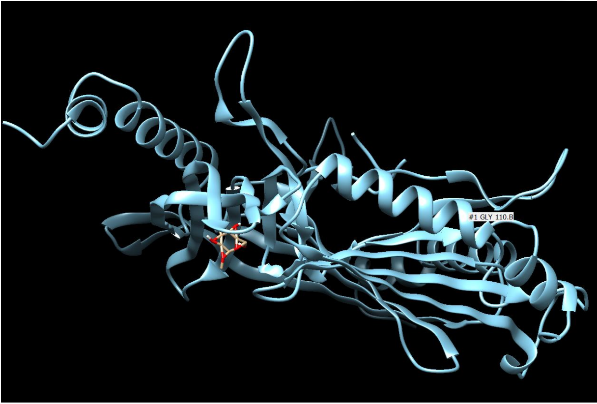

## Accenture – Data Analytics & Visualisation (Virtual Experience)

**Context:**  
Forage virtual job simulation based on real-world Accenture analytics case scenarios.

**What I worked on:**
- Interpreted business requirements and defined analysis objectives
- Cleaned and modelled datasets for reporting use
- Designed data visualisations and dashboards for storytelling
- Presented insights in a client-style format

**Evidence:**  
- [Forage Certificate – Data Analytics & Visualisation](assets/Data Analytics and Visualization Job Simulation certificate.pdf)

**Tools:** Power BI, SQL concepts, data modelling, data storytelling
---

## Accenture – Consultant Job Simulation (Virtual Experience)

**Context:**  
Forage consulting simulation focused on digital transformation scenarios.

**What I worked on:**
- Set project priorities and structured delivery plans
- Analysed user journeys to identify friction points
- Assessed outcomes and proposed improvements
- Applied prioritisation and impact assessment techniques

**Evidence:**  
- [Forage Certificate – Consultant Simulation](assets/Consultant Job Simulation certificate.pdf)

**Skills:** Business analysis, UX analytics, prioritisation, stakeholder-style communication
---

## MSc Project – Viral Dynamics Simulation (Aston University)

**Problem:**  
Large-scale molecular simulation data required automated analysis to assess system stability and interaction behaviour.

**What I did:**
- Processed and analysed 50GB+ of molecular simulation output data using Python
- Built automated pipelines for RMSD-based stability analysis
- Applied statistical validation and visual diagnostics to interpret results
- Structured and analysed data generated from high-performance computing runs

### Selected visuals

**Simulation stability (RMSD analysis):**

**Protein–ligand interaction snapshot:**

  

  

**Outcome:**  
Improved reliability and repeatability of complex simulation analysis, enabling faster and more confident interpretation of results.

**Evidence:**  
- [Final Dissertation (PDF)](assets/Dissertation.pdf)

**Tech:** Python, data pipelines, statistical analysis, automation
---

## BSc Project – Community Complaint Analytics System

**Problem:**  
Manual, paper-based complaint handling caused delays and lack of visibility for community issues.

**What I did:**
- Designed a relational SQL database to store and track complaints
- Built a web-based system to capture, manage, and acknowledge reports
- Implemented role-based workflows for users and administrators
- Structured data for reporting and operational tracking

**Outcome:**  
Created a centralised system that improved traceability and response handling compared to manual processes.

**Evidence:**  
- [Final Project Report (PDF)](assets/BSc-Project-Report.pdf)

**Tech:** SQL, ASP.NET, database design
---
